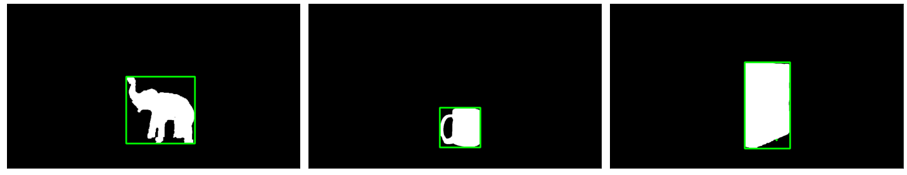
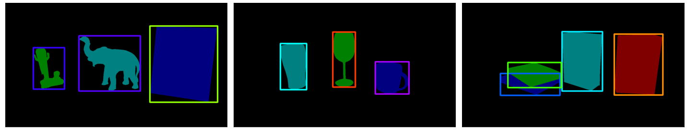

**<h1>mask-to-annotation</h1>**
<!-- Describe the software -->
**mask-to-annotation** is a powerful and efficient tool for automatically generating annotations in popular computer vision formats such as COCO, YOLO, and VGG from binary and colored masks.

By leveraging contour detection algorithms and image processing techniques, our software automates the annotation process, saving valuable time and effort.

**<h2 name="abstract">Abstract</h2>**
*In modern computer vision models, the quality and quantity of training data have become crucial. Datasets deemed sufficient a few years ago now require augmentation with additional datasets. This presents a challenge, especially when these supplementary datasets lack annotations in standard formats like COCO, VGG, or YOLO. One solution to this problem is to learn semantic boundaries from binary images of unannotated datasets, thereby increasing the data available for training and evaluating models. However, choosing an efficient annotation method can be both time-consuming and effort-intensive. This research paper explores three approaches, ranging from traditional image processing algorithms to the recently introduced Segment Anything Model (SAM). The study demonstrates how these different algorithms perform on various datasets and concludes that the proposed image processing method strikes the best balance between performance and efficiency.*

<hr>

**<h2 name="coco-annotations">Table of Contents</h2>**

- **[Examples](#examples)**
  - [Single Objects](#single-objects)
  - [Multiple Objects](#multiple-objects)
  - [COCO Annotations](#coco-annotations)
  - [YOLO Annotations](#yolo-annotations)
  - [VGG Annotations](#vgg-annotations)
- **[Documentation](#documentation)**
  - [Installation Details](#installation-details)
  - [COCO Annotation Function](#coco-annotation-function)
  - [YOLO Annotation Function](#yolo-annotation-function)
  - [VGG Annotation Function](#vgg-annotation-function)
- **[Citation](#citation)**

<hr>

**<h1 name="examples">Examples</h1>**

**<h2 name="single-objects">Single Objects</h2>**
<!-- Show images -->
<h3>Sample Images</h3>

<p align="center"></p>

<h3>Polygon Annotation</h3>
<p align="center"></p>

<h3>Bounding Box Annotation</h3>
<p align="center"></p>

**<h2 name="multiple-objects">Multiple Objects</h2>**
<!-- Show images -->
<h3>Sample Images</h3>

<p align="center"></p>

<h3>Polygon Annotation</h3>
<p align="center"></p>

<h3>Bounding Box Annotation</h3>
<p align="center"></p>


**<h2 name="coco-annotations">COCO Annotations</h2>**
<!-- Show json output -->
<h3>Annotation (JSON)</h3>

```json
{
    "info": {
        "description": "COTSDataset"
    },
    "images": [
        {
            "id": 0,
            "width": 1280,
            "height": 720,
            "file_name": "souveniers_oc_3_colour_mask_1_mask.png"
        }
    ],
    "annotations": [
        {
            "id": 0,
            "iscrowd": 0,
            "image_id": 0,
            "category_id": 0,
            "segmentation": [
                [
                    ...
                ]
            ],
            "bbox": [
                ...
            ],
            "area": 32067.5
        }
    ],
    "categories": [
        {
            "id": 0,
            "name": "souvenirs_oc"
        }
    ]
}
```

<hr>

**<h2 name="yolo-annotations">YOLO Annotations</h2>**
<!-- Show txt output -->
<h3>Annotation (TXT)</h3>

```python
# souvenirs_no_3_colour_mask_1_mask.txt
0 0.69882812 0.65972222 0.32578125 0.48055555

# labels.txt
souvenirs_oc
```

<hr>

**<h2 name="vgg-annotations">VGG Annotations</h2>**
<!-- Show json output -->
<h3>Annotation (JSON)</h3>

```json
{
    "food_3_colour_mask_1_mask.png": {
        "fileref": "",
        "size": 1280,
        "filename": "food_3_colour_mask_1_mask.png",
        "base64_img_data": "",
        "file_attributes": {},
        "regions": {
            "0": {
                "shape_attributes": {
                    "name": "polygon",
                    "all_points_x": [
                        ...
                    ],
                    "all_points_y": [
                        ...
                    ]
                },
                "region_attributes": {
                    "label": "food_no"
                }
            }
        }
    }
}
```

<hr>

**<h1 name="documentation">Documentation</h1>**
**<h2 name="installation-details">Installation Details</h2>**
To use this package, you must first install the following dependencies:
```python
pip install numpy
pip install opencv-python
pip install matplotlib
```

To perform the annotations, you must also install the following python files from this repository:
- `coco.py`
- `vgg.py`
- `yolo.py`
- `annotation_helper.py`


Kindly note that in case any problems arise, one can easily clone the environment used for this project using the `environment.yml` file in the environment folder. Additionally, the `requirements.txt` file in the environment folder contains all the dependencies used in this project.

To install the environment, run the following command:
```python
cd Environment
conda env create -f environment.yml
conda activate mask-to-annotation
```

To install the dependencies, run the following command:
```python
cd Environment
pip install -r requirements.txt
```

**<h2 name="coco-annotation-function">COCO Annotation Function</h2>**

To generate COCO annotations, use the `coco.py` module.
For ease-of-use, the following function was created to generate COCO annotations from the inputted mask image:
<details>
<summary  style="color: lightblue;"><b> coco.annotate(**params)</b></summary>

- `image` : The input mask image to be annotated.
- `do_display` : A boolean value indicating whether or not to display the annotated image.
- `do_save` : A boolean value indicating whether or not to save the annotated image.
- `annotation_color` : The color of the annotation.
- `epsilon` : The epsilon value for the contour approximation algorithm. The default value is 0.005.
- `configuration` : The configuration of the annotation:
  - `coco.POLY_APPROX` : Polygon approximation.
  - `coco.K_MEANS_CLUSTER` : K-means clustering.
- `object_configuration` : The object configuration of the annotation:
  - `coco.SINGLE_OBJ` : Single object.
  - `coco.MULTIPLE_OBJ` : Multiple objects.
- `do_cvt` : A boolean value indicating whether or not to convert the image to RGB.
</details>

**<h2 name="yolo-annotation-function">YOLO Annotation Function</h2>**

To generate YOLO annotations, use the `yolo.py` module.
For ease-of-use, the following function was created to generate YOLO annotations from the inputted mask image:
<details>
<summary  style="color: lightblue;"><b> yolo.annotate(**params)</b></summary>

- `image` : The input mask image to be annotated.
- `do_display` : A boolean value indicating whether or not to display the annotated image.
- `do_save` : A boolean value indicating whether or not to save the annotated image.
- `annotation_color` : The color of the annotation.
- `object_configuration` : The object configuration of the annotation:
  - `yolo.SINGLE_OBJ` : Single object.
  - `yolo.MULTIPLE_OBJ` : Multiple objects.
- `do_cvt` : A boolean value indicating whether or not to convert the image to RGB.
</details>

**<h2 name="vgg-annotation-function">VGG Annotation Function</h2>**

To generate VGG annotations, use the `vgg.py` module.
For ease-of-use, the following function was created to generate VGG annotations from the inputted mask image:
<details>
<summary  style="color: lightblue;"><b> vgg.annotate(**params)</b></summary>

- `image` : The input mask image to be annotated.
- `do_display` : A boolean value indicating whether or not to display the annotated image.
- `do_save` : A boolean value indicating whether or not to save the annotated image.
- `annotation_color` : The color of the annotation.
- `epsilon` : The epsilon value for the contour approximation algorithm. The default value is 0.005.
- `configuration` : The configuration of the annotation:
  - `vgg.POLY_APPROX` : Polygon approximation.
  - `vgg.K_MEANS_CLUSTER` : K-means clustering.
- `object_configuration` : The object configuration of the annotation:
  - `vgg.SINGLE_OBJ` : Single object.
  - `vgg.MULTIPLE_OBJ` : Multiple objects.
- `do_cvt` : A boolean value indicating whether or not to convert the image to RGB.
</details>

**<h1 name="citation">Citation</h1>**

To cite this paper, kindly use the following citation:

```bib
@INPROCEEDINGS{10473513,
  author={Seychell, Dylan and Kenely, Matthew and Bartolo, Matthias and Debono, Carl James and Bugeja, Mark and Sacco, Matthew},
  booktitle={2023 IEEE International Symposium on Multimedia (ISM)}, 
  title={Efficient Automatic Annotation of Binary Masks for Enhanced Training of Computer Vision Models}, 
  year={2023},
  volume={},
  number={},
  pages={256-259},
  keywords={Training;YOLO;Computer vision;Annotations;Computational modeling;Clustering algorithms;Training data;Computer Vision;Data Annotation;Datasets},
  doi={10.1109/ISM59092.2023.00049}}

```

The paper associated with mask-to-annotation is available for free as an open-access paper on IEEE: https://ieeexplore.ieee.org/document/10473513