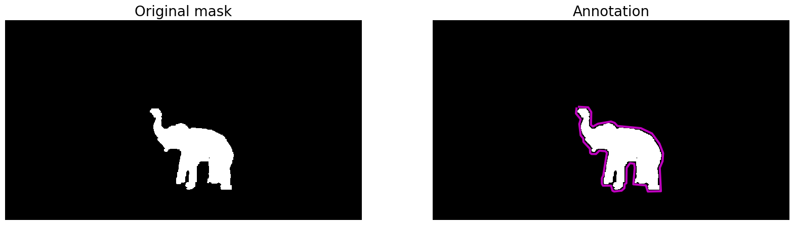
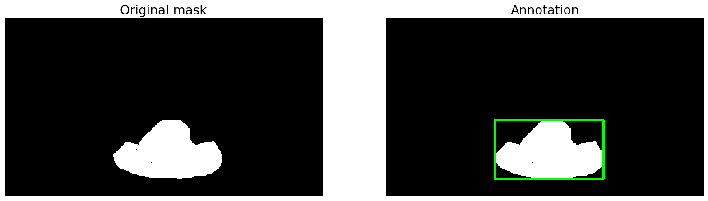
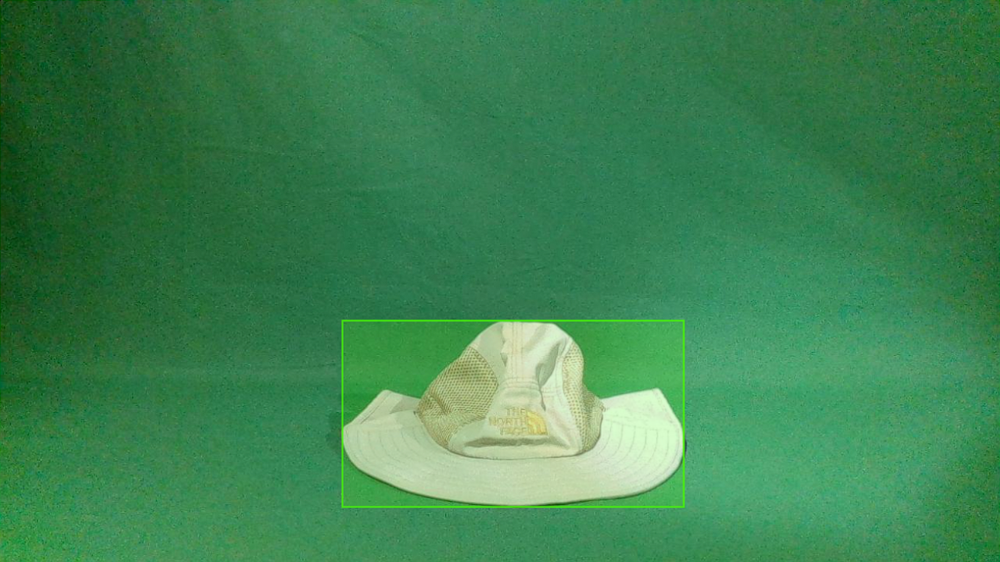
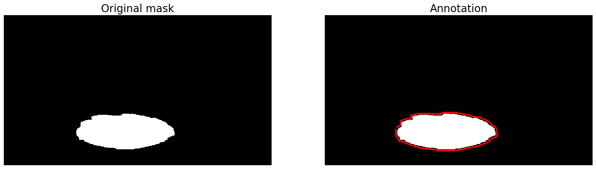
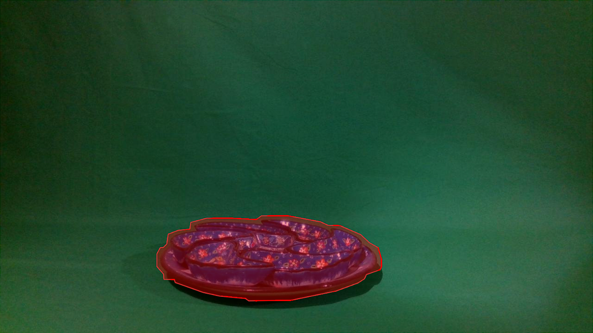

**<h1>mask-to-annotation</h1>**
<!-- Describe the software -->
Lorem ipsum dolor sit amet, consectetur adipiscing elit, sed do eiusmod tempor incididunt ut labore et dolore magna aliqua.


<hr>

**<h2 name="coco-annotations">Table of Contents</h2>**

**[COCO Annotations](#coco-annotations)** \
**[YOLO Annotations](#yolo-annotations)** \
**[VGG Annotations](#vgg-annotations)** \
**[Annotation Generation Pipeline](#annotation-pipeline)**

<hr>

**<h2 name="coco-annotations">COCO Annotations</h2>**
<!-- Show images -->
<h3>Images</h3>
<p align="center"></p>
<p align="center"></p>


<!-- Show json output -->
<h3>Annotation (JSON)</h3>

```json
{
    "info": {
        "description": "COTSDataset"
    },
    "images": [
        {
            "id": 0,
            "width": 1280,
            "height": 720,
            "file_name": "souveniers_oc_3_colour_mask_1_mask.png"
        }
    ],
    "annotations": [
        {
            "id": 0,
            "iscrowd": 0,
            "image_id": 0,
            "category_id": 0,
            "segmentation": [
                [
                    ...
                ]
            ],
            "bbox": [
                ...
            ],
            "area": 32067.5
        }
    ],
    "categories": [
        {
            "id": 0,
            "name": "souvenirs_oc"
        }
    ]
}
```

<hr>

**<h2 name="yolo-annotations">YOLOv4 Annotations</h2>**
<!-- Show images -->
<h3>Images</h3>
<p align="center"></p>
<p align="center"></p>


<!-- Show txt output -->
<h3>Annotation (TXT)</h3>

```python
# souvenirs_no_3_colour_mask_1_mask.txt
0 0.69882812 0.65972222 0.32578125 0.48055555

# labels.txt
souvenirs_oc
```

<hr>

**<h2 name="vgg-annotations">VGG Annotations</h2>**
<!-- Show images -->
<h3>Images</h3>
<p align="center"></p>
<p align="center"></p>

<!-- Show json output -->
<h3>Annotation (JSON)</h3>

```json
{
    "food_3_colour_mask_1_mask.png": {
        "fileref": "",
        "size": 1280,
        "filename": "food_3_colour_mask_1_mask.png",
        "base64_img_data": "",
        "file_attributes": {},
        "regions": {
            "0": {
                "shape_attributes": {
                    "name": "polygon",
                    "all_points_x": [
                        ...
                    ],
                    "all_points_y": [
                        ...
                    ]
                },
                "region_attributes": {
                    "label": "food_no"
                }
            }
        }
    }
}
```

**<h2 name="annotation-pipeline">Annotation Generation Pipeline</h2>**
```python
{annotation style}.py:

def mask_to_annotation(mask):
. . .

def display(im_dict, annotation_color):
. . .

def save(im_dict):
. . .

def annotate(im, do_display=True, do_save=True, annotation_color='g'):
. . .

```
